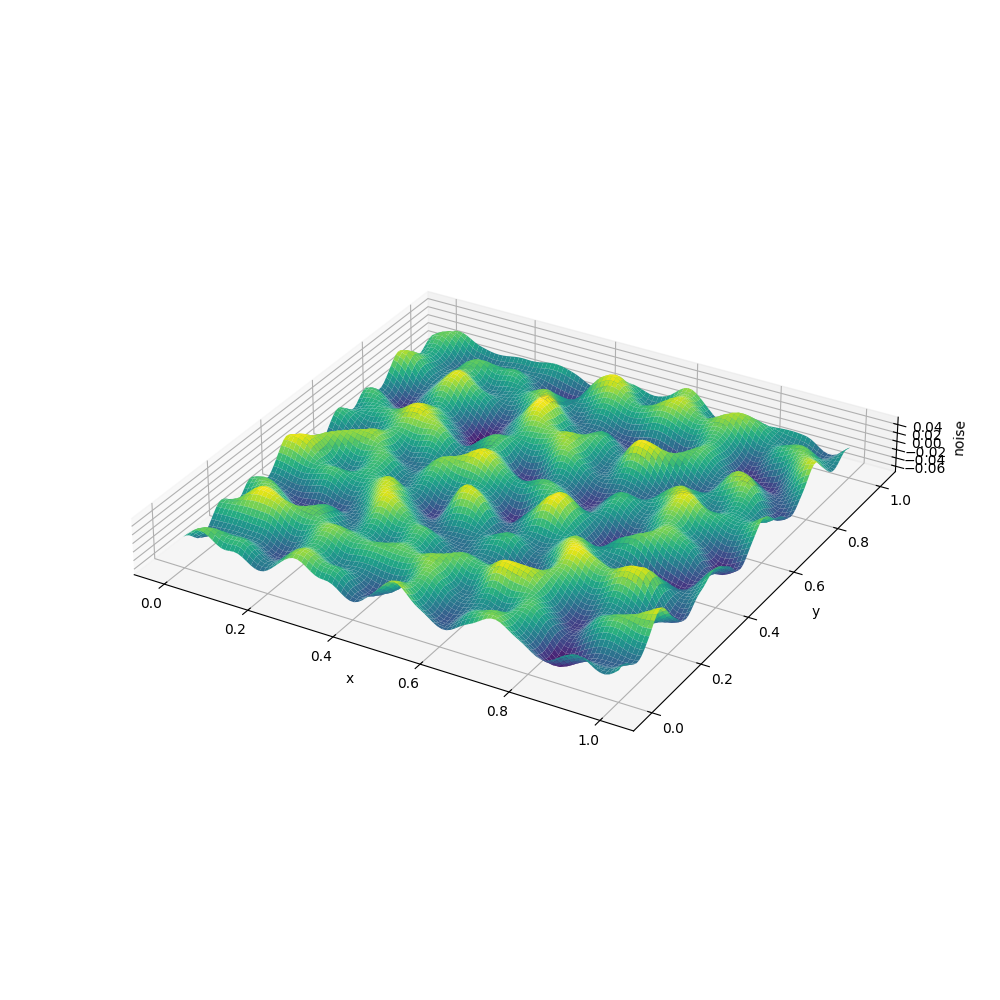

# terrain-noise-workbench-2026

`terrain-noise-workbench-2026`은 Perlin, OpenSimplex, fBm 계열 노이즈를 CPU와 GPU에서 비교하며 지형처럼 다뤄 보는 Python 실험 저장소다. 단일 렌더링 앱이 아니라 heightfield, 정적 terrain export, 구면 terrain, Marching Squares/Cubes, Transform Feedback를 한 폴더 안에서 확인하는 작업대에 가깝다.



이 저장소의 전신 이름은 `perlin-in-hand`였지만, 현재 내용은 Perlin 하나보다 넓다. 그래서 프로젝트 이름을 `terrain-noise-workbench-2026`으로 정리한다.

## 현재 정리 상태

| 항목 | 기준 |
| --- | --- |
| 프로젝트 이름 | `terrain-noise-workbench-2026` |
| 기본 브랜치 | `main` |
| 기본 Python | `3.12.12` |
| 패키지 관리 | `uv` |
| 실행 범위 | CPU/GPU 실험과 ImGui 기반 terrain 생성기/뷰어 |

이 프로젝트는 `Python 3.12.12`를 사용한 상태로 정리한다. `pyproject.toml`의 Python 범위도 `>=3.12,<3.13`으로 고정한다.

`Python 3.13` 이상으로 올리지 않는다. 이유는 이 저장소가 `imgui==2.0.0`을 직접 사용하며, 2026-07-09에 별도 clean install로 확인한 결과 `Python 3.13.12`와 `Python 3.14.6`에서 `imgui==2.0.0` C 확장 빌드가 실패했기 때문이다. 자세한 테스트 표와 판단 근거는 [Python 3.12.12 고정과 ImGui 의존성](docs/python_imgui_compatibility.md)에 둔다.

## 폴더 구조

| 경로 | 내용 |
| --- | --- |
| `implementations/heightfield_cpu` | 직접 구현 Perlin, `perlin`, `opensimplex`를 matplotlib 표면으로 확인하는 CPU heightfield 실험 |
| `implementations/heightfield_gpu` | ModernGL 셰이더에서 Perlin/OpenSimplex heightfield와 법선을 계산하는 GPU 실험 |
| `implementations/terrain_gpu_runtime_common` | GPU terrain 생성기와 뷰어가 공유하는 레이어, export/import, ImGui 패널 코드 |
| `implementations/terrain_gpu_generator_plane` | 평면 heightfield 지형을 GPU에서 구워 `.npz`로 저장하는 생성기 |
| `implementations/terrain_gpu_generator_sphere` | icosphere 방향 벡터를 3D 노이즈에 넣어 구면 지형을 만드는 생성기 |
| `implementations/terrain_gpu_viewer` | export된 terrain `.npz`를 ModernGL로 다시 여는 뷰어 |
| `implementations/terrain_legacy_*` | CPU 생성기와 matplotlib/pygame 기반 확인 도구 |
| `implementations/gpu_marching_squares` | 2D 밀도장에서 등고선 선분을 추출하는 Transform Feedback 실험 |
| `implementations/gpu_marching_cubes` | 3D/4D 밀도장에서 등가면 삼각형을 추출하는 Transform Feedback 실험 |
| `docs` | 카메라, transform feedback, spherical terrain, ImGui 패널, 노이즈 비교 문서 |

## 설치

기본 환경은 `Python 3.12.12`를 사용한다.

```powershell
uv sync --python 3.12.12
```

`3.13` 이상으로 올리지 않는다. 특히 ImGui 기반 실행 파일을 유지하려면 `3.12.12` 기준으로 환경을 다시 만든다.

```powershell
uv run python --version
```

## ImGui 의존성

ImGui 기반 파일은 아래처럼 `import imgui` 또는 `moderngl_window.integrations.imgui`에 의존한다.

- `implementations/terrain_gpu_generator_plane/main_terrain_gpu_generator_plane.py`
- `implementations/terrain_gpu_generator_sphere/main_terrain_gpu_generator_sphere.py`
- `implementations/terrain_gpu_viewer/main_terrain_gpu_viewer.py`
- `implementations/terrain_legacy_generator_cpu/main_terrain_legacy_generator_cpu.py`
- `implementations/terrain_gpu_runtime_common/terrain_imgui.py`
- `implementations/terrain_legacy_common/terrain_imgui.py`

`imgui>=2.0.0`은 기본 의존성이다. 이 프로젝트에서 ImGui 도구는 부가 기능이 아니라 terrain 생성기/뷰어의 일부다. 따라서 `imgui`를 빼고 최신 Python만 맞추는 방식은 이 저장소의 기준 실행 환경으로 보지 않는다.

2026-07-09 확인 결과, 깨끗한 `Python 3.13.12`와 `Python 3.14.6` 환경에서 `imgui==2.0.0` 빌드는 C API 오류로 실패했다. 그래서 이 저장소는 `Python 3.12.12`에 머문다.

## 실행 예

먼저 확인하기 쉬운 실행 예는 다음과 같다.

```powershell
uv run .\implementations\heightfield_cpu\main_perlin_my_cpu.py
uv run .\implementations\heightfield_cpu\main_perlin_2002_cpu.py
uv run .\implementations\heightfield_cpu\main_opensimplex_2014_cpu.py
uv run .\implementations\heightfield_gpu\main_perlin_2002_gpu.py
uv run .\implementations\heightfield_gpu\main_opensimplex_2014_gpu.py
uv run .\implementations\gpu_marching_squares\main_simplex_2d_gpu_marching_squares.py
uv run .\implementations\gpu_marching_cubes\main_opensimplex_2014_gpu_4d.py
```

GPU 실행 파일은 ModernGL이 OpenGL 컨텍스트를 만들 수 있는 로컬 그래픽 환경을 필요로 한다.

ImGui 기반 terrain 도구는 다음처럼 실행한다.

```powershell
uv run .\implementations\terrain_gpu_generator_plane\main_terrain_gpu_generator_plane.py
uv run .\implementations\terrain_gpu_generator_sphere\main_terrain_gpu_generator_sphere.py
uv run .\implementations\terrain_gpu_viewer\main_terrain_gpu_viewer.py
```

## 산출물과 로컬 전용 폴더

실행 결과는 저장소에 기본 포함하지 않는다.

| 경로 | 의미 |
| --- | --- |
| `.venv/` | `uv sync`가 만드는 로컬 가상환경 |
| `outputs/` | CPU/GPU 실험에서 생성되는 이미지, 영상, 기타 출력 |
| `exports/` | terrain 생성기가 저장하는 `.npz` 메시 export |
| `__pycache__/` | Python 캐시 |

export `.npz` 메타데이터의 format 이름도 `terrain-noise-workbench-2026 terrain npz`로 정리했다.

## 문서

- `docs/spherical_terrain_3d_noise.md`: 구면 terrain을 3D 방향 벡터 샘플링으로 만드는 실험 기록
- `docs/spherical_terrain_study.md`: 평면 heightfield와 구면 terrain의 차이 정리
- `docs/transform_feedback_pipeline.md`: Transform Feedback 파이프라인과 terrain bake, Marching Squares/Cubes 비교
- `docs/terrain_generation_options.md`: terrain 레이어 종류와 속성 설명
- `docs/terrain_imgui_widget.md`: ImGui 패널 구현과 Python 3.12.12 고정 이유
- `docs/python_imgui_compatibility.md`: Python 3.12.12 고정과 ImGui clean install 테스트 결과
- `docs/noise_complexity_comparison.md`: Perlin/Simplex 노이즈의 연산 절차 비교
- `docs/terrain_synthesis_methods.md`: 산맥, 평야, 협곡 등으로 노이즈를 가공하는 합성 메모

## 검증 기준

기본 환경 검증은 다음 순서로 본다.

```powershell
uv lock --check
uv sync --python 3.12.12
uv run python -m compileall implementations
uv run python -c "import numpy, matplotlib, moderngl, glcontext, imageio, opensimplex, pygame, imgui; print('dependencies ok')"
```

검증 기준도 `Python 3.12.12`다. `Python 3.13` 이상으로 올리는 작업은 현재 허용하지 않는다.
