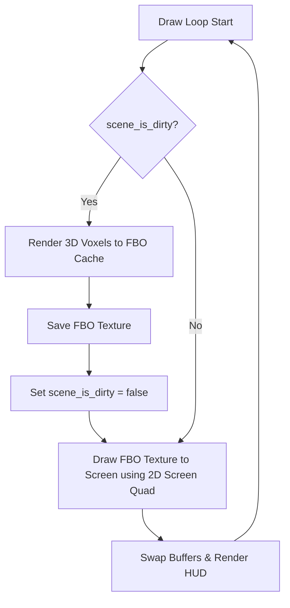

# 🏔️ 3D 지형 렌더링 & GUI 아키텍처 기술 Q&A

본 문서는 `moderngl-window` 환경에서 발생한 성능(FPS/dt) 이슈, 화면 최대화 버그의 원인 분석 및 해결책, GUI 아키텍처 대안, 그리고 펄린 노이즈와 오픈심플렉스 노이즈의 알고리즘별 시각적·수학적 특성 차이를 정리한 종합 기술 Q&A 문서입니다.

---

## Q1. `mglw.run_window_config`는 복합 메뉴를 고려하지 않은 단순 데모용 유틸리티인가요?

### **A: 네, 정확합니다.**
`mglw.run_window_config`는 입문 및 빠른 데모 화면 출력을 위해 창 생성, 컨텍스트 바인딩, 이벤트 처리 및 루프를 내부적으로 캡슐화한 **Blocking 형태의 단순 래퍼(Wrapper)**입니다. 이로 인해 사이드 패널, 입력 창, 복합 메뉴바 등 복잡한 데스크톱 UI 요소를 설계하는 것은 불가능에 가깝습니다.

이를 해결하고 **복합 메뉴를 가진 전문적인 그래픽 소프트웨어**를 만들기 위한 아키텍처 대안은 크게 두 가지가 있습니다.

### 대안 A: PySide6 (Qt) + ModernGL 연동 (★ 강력 추천)
데스크톱 GUI 표준인 **Qt** 프레임워크를 기반으로 메인 윈도우 및 설정 메뉴(슬라이더, 콤보박스, 버튼 등)를 구성하고, 3D 화면 영역만 Qt 내부 위젯인 `QOpenGLWidget`을 사용해 ModernGL로 그리는 아키텍처입니다.

```python
import sys
import moderngl
from PySide6.QtWidgets import QApplication, QMainWindow, QWidget, QHBoxLayout, QVBoxLayout, QSlider, QLabel
from PySide6.QtGui import QSurfaceFormat
from PySide6.QtOpenGLWidgets import QOpenGLWidget

class ModernGLRenderWidget(QOpenGLWidget):
    """3D 지형 렌더링 영역만 담당하는 Qt 위젯"""
    def initializeGL(self):
        # Qt가 준비한 OpenGL 컨텍스트를 ModernGL에 연동
        self.ctx = moderngl.create_context()
        # 셰이더 및 버퍼 초기화 코드 작성...
        
    def paintGL(self):
        # 매 프레임 화면을 그리는 코드 (기존 on_render 부분)
        self.ctx.clear(0.08, 0.08, 0.12, 1.0)
        # 3D 렌더링 수행...

class MainWindow(QMainWindow):
    """전체 컨트롤 패널과 윈도우 레이아웃 정의"""
    def __init__(self):
        super().__init__()
        self.setWindowTitle("3D Terrain Controller")
        
        main_widget = QWidget()
        layout = QHBoxLayout(main_widget)
        
        # 1. 좌측: 설정 사이드 패널
        control_panel = QWidget()
        control_layout = QVBoxLayout(control_panel)
        control_layout.addWidget(QLabel("Amplitude (진폭)"))
        self.amp_slider = QSlider()
        control_layout.addWidget(self.amp_slider)
        
        # 2. 우측: 3D 렌더링 위젯
        self.gl_widget = ModernGLRenderWidget()
        
        layout.addWidget(control_panel, stretch=1)
        layout.addWidget(self.gl_widget, stretch=4)
        self.setCentralWidget(main_widget)

if __name__ == "__main__":
    fmt = QSurfaceFormat()
    fmt.setVersion(3, 3)
    fmt.setProfile(QSurfaceFormat.OpenGLContextProfile.CoreProfile)
    QSurfaceFormat.setDefaultFormat(fmt)

    app = QApplication(sys.argv)
    window = MainWindow()
    window.show()
    sys.exit(app.exec())
```

### 대안 B: 수동 이벤트 루프 + Dear ImGui 연동
현재의 `moderngl-window` 환경을 유지하면서 가볍고 반응성이 빠른 오버레이 형태의 슬라이더 메뉴 패널을 화면 위에 띄우고 싶을 때 적합합니다. 루프의 통제권을 가져오기 위해 직접 `while` 루프를 실행합니다.

```python
import moderngl_window as mglw
from moderngl_window.integrations.imgui import ModernglWindowRenderer
import imgui

# 윈도우 수동 생성 및 컨텍스트 확보
wnd = mglw.create_window_from_settings()
ctx = wnd.ctx

# ImGui 초기화
imgui.create_context()
imgui_renderer = ModernglWindowRenderer(wnd)

# 수동 이벤트 루프 실행
while not wnd.is_closing:
    wnd.clear() # 화면 지우기
    imgui.new_frame() # ImGui 프레임 시작
    
    # 3D 지형 렌더링 연산...
    
    # ImGui UI 오버레이 메뉴 구성
    if imgui.begin("지형 설정 패널"):
        _, amplitude = imgui.slider_float("Amplitude", amplitude, 0.01, 0.5)
        _, frequency = imgui.slider_float("Frequency", frequency, 1.0, 50.0)
    imgui.end()
    
    # ImGui 드로잉 데이터 렌더링 및 화면 버퍼 교체
    imgui.render()
    imgui_renderer.render(imgui.get_draw_data())
    wnd.swap_buffers()
```

---

## Q2. 화면을 최대화할 때 뷰(카메라)가 완전히 뒤집혔던 이유는 무엇인가요?

### **A: 이벤트 델타 노이즈와 lookAt 수식의 특이점(Singularity) 때문이었습니다.**
1. **마우스 델타 급증**: Windows OS 단에서 창을 최대화(Maximize)할 때 창의 크기가 급격히 변하면서 마우스 상대 좌표가 순간적으로 튀어 수백 픽셀의 비정상적인 `dy` 값이 전달됩니다.
2. **수직 극점 도달**: 이 과도한 움직임으로 인해 카메라의 수직 회전각(`angle_y`)이 최댓값(-5도 혹은 -175도)으로 쏠리게 되었습니다.
3. **lookAt 행렬의 상하 반전**: 카메라가 피사체를 거의 정수리(수직 머리 위)에서 수직으로 내려다보게 되면, 카메라의 시선 벡터가 고정된 하늘 벡터(Up Vector: `0, 1, 0`)와 평행하게 일직선상에 놓이게 됩니다. 이때 외적(Cross Product) 연산 결과가 0에 수렴하면서 아주 미세한 소수점 오차에 의해 카메라의 좌우/상하 기준 축이 180도 돌아가 뒤집히는 물리 현상이 발생합니다.

### **해결 조치**
* 창 최대화/크기 조정 시 발생하는 급격한 마우스 델타 점프(`abs(dx) > 100` 등)를 무시하는 예외 필터를 추가했습니다.
* 카메라가 수직 일직선 상태에 도달해 축 반전이 일어나지 않도록 `angle_y` 최댓값을 극점에서 10도 이상 안전 거리를 확보한 `[-170도, -10도]`로 제한하여 완전히 방지했습니다.

---

## Q3. 3600 FPS가 나오던 것과 60 FPS로 제한한 것의 내부 연산 차이가 무엇인가요?

### **A: 계산에 주입되는 `dt`(`frametime`) 값이 달라졌으며, 불필요한 연산이 생략되었습니다.**
* **3,600 FPS**: 엔진이 감지하는 실제 프레임 간격(`dt`)이 약 **0.00028초(0.28ms)**로 매우 짧습니다.
* **60 FPS**: 수동 딜레이(`time.sleep`)를 부여하여 엔진이 측정한 프레임 간격(`dt`)이 약 **0.0166초(16.6ms)**로 늘어납니다.

### **애니메이션 속도가 일정하게 유지되는 원리**
코드 내부에서 시간을 더해주는 공식은 다음과 같습니다:
`self.time_val += frametime * 0.2` (여기서 `frametime`이 `dt`에 해당)
* 3600 FPS일 때는 극도로 작은 `dt`(`0.00028초`)가 3,600번 더해져 1초 동안 총 **0.2**만큼 전진합니다.
* 60 FPS일 때는 60배 큰 `dt`(`0.0166초`)가 60번 더해져 1초 동안 똑같이 **0.2**만큼 전진합니다.

결과적으로 실제 눈에 보이는 움직임의 속도는 완벽하게 동일하지만, 사람이 눈으로 인지하지 못하는 3,540번의 중복 연산과 드로잉 단계를 생략하여 **GPU 사용량을 50% 이상에서 1~2% 수준으로 극적으로 절약**하게 되었습니다.

---

## Q4. 동일한 주파수(Frequency)를 설정해도 펄린 노이즈와 오픈심플렉스 노이즈의 시각적 주파수(고주파 특성)가 다르게 보이는 이유는 무엇인가요?

### **A: 격자(Lattice) 구조의 면적 밀도 차이와 방사형 가중치 필터(Radial Decay Filter)의 차이 때문입니다.**

동일한 주파수 파라미터(예: `frequency = 10.0`)를 설정하고 비교해 보면, **오픈심플렉스(OpenSimplex)**가 펄린(Perlin) 노이즈에 비해 훨씬 오밀조밀하고 뾰족한 고주파 세부 디테일이 눈에 띄게 많이 생성됩니다. 이는 다음과 같은 세 가지 설계적 차이로 인해 발생합니다.

#### 1. 격자 기하구조에 따른 실질 밀도 차이
* **펄린 노이즈 (Perlin)**: $1.0 \times 1.0$ 크기의 정사각형(Square) 격자를 기준으로 좌표를 생성하고 보간합니다.
* **오픈심플렉스 (OpenSimplex)**: 공간을 정삼각형 격자(BCC Lattice) 형태로 매핑하기 위해 좌표 계산 전에 내부적으로 약 **0.366배 축소/회전하는 변환(Shearing/Unshearing)**을 적용합니다. 
* 결과적으로 동일한 입력 좌표 범위 안에서 오픈심플렉스는 펄린에 비해 **더 작은 크기의 격자 단위**를 갖게 되며, 격자 꼭짓점이 훨씬 촘촘하게 배치되어 결과물이 고주파 성향을 띠게 됩니다.

#### 2. 보간(Fade) 방식과 감쇠 필터 반경의 차이
* **펄린 노이즈**: 4개 꼭짓점 사이의 넓은 사각형 공간 전체를 가로·세로 축 방향으로 $6t^5 - 15t^4 + 10t^3$ 곡선을 그리며 서서히 보간합니다. 이로 인해 경사면이 완만하고 둥근 형태의 구릉(둔덕)이 넓게 형성됩니다.
* **오픈심플렉스**: 축 방향의 보간 대신, 각 꼭짓점을 중심으로 하는 **동그란 영향력 반경(Radial Decay)** 함수 $w = \max(0, r^2 - d^2)^4$를 직접 사용합니다.
  * 영향력 반경 $r^2$ 값의 설정이 상대적으로 작고($0.5 \sim 0.6$), 경계에 다다를수록 가중치가 빠르게 감쇠합니다.
  * 영향력 범위가 좁고 급격하게 차단되므로, 노이즈 값이 양수(+)와 음수(-)를 오가는 폭이 펄린보다 좁은 반경 내에서 빠르게 일어나 지형이 **더 날카롭고 뾰족하게(Sharp)** 표현됩니다.

#### 3. 방향성 왜곡(Diagonal Stretching) 유무
* **펄린 노이즈**는 사각 격자 구조상 대각선 방향(길이 $\sqrt{2} \approx 1.414$)으로 갈수록 꼭짓점 사이가 늘어나 특정 대각선 방향으로 텍스처가 뭉개지거나 저주파 형태의 블러가 발생합니다.
* **오픈심플렉스**는 어느 방향으로든 꼭짓점 사이의 거리 분포가 일정(Isotropic)하여 방향성 왜곡(Diagonal Stretching)이 발생하지 않습니다. 덕분에 전 방향으로 고주파 디테일이 왜곡 없이 고르게 살아납니다.

---

## Q5. 4차원 Simplex 노이즈 기반 복셀 블록에서 고도(Z축 또는 Y축)에 따라 밀도 불균일이 나타났던 원인과 해결책은 무엇인가요?

### **A: 두 가지 원인이 있었습니다: 1) 셰이더 내부 Swizzle 상수 오차, 2) 인위적인 고도 감쇠 함수.**

#### 1. 셰이더 내 4차원 Simplex Corner Swizzle 상수 오차
`snoise(vec4 v)` 함수 내부에서 4번째 Simplex 꼭짓점(`x4`)의 오프셋 좌표를 아래와 같이 런타임 수치 연산식으로 계산하고 있었습니다:
```glsl
vec4 x1 = x0 - i1 + 1.0 * C.xxxx;
vec4 x2 = x0 - i2 + 2.0 * C.xxxx;
vec4 x3 = x0 - i3 + 3.0 * C.xxxx;
vec4 x4 = x0 - 1.0 + 4.0 * C.xxxx; // 런타임 연산
```
* **문제점**: 이 식은 일부 GPU 드라이버 컴파일 과정에서 스칼라와 벡터의 형변환 및 연산 최적화 순서에 의해 정밀도 왜곡(drift)을 발생시킵니다. 이로 인해 4차원 공간 격자가 대각선 방향으로 비틀리는 왜곡(skew)이 생겼고, 4D 노이즈의 3번째 좌표(Z축) 축 정렬 밀도 분포가 불균일해지는 현상으로 이어졌습니다.
* **해결 조치**: Ashima Arts 표준 스펙에 맞추어, 컴파일러가 직접 하드웨어 상수 레지스터에서 값을 로드할 수 있도록 미리 계산된 swizzled 상수 벡터(`C.xxxx`, `C.yyyy`, `C.zzzz`, `C.wwww`)를 이용하는 직접 매핑으로 수정했습니다.
  ```glsl
  vec4 x1 = x0 - i1 + C.xxxx;
  vec4 x2 = x0 - i2 + C.yyyy;
  vec4 x3 = x0 - i3 + C.zzzz;
  vec4 x4 = x0 + C.wwww;
  ```

#### 2. 인위적인 고도(Y축) 감쇠 항의 존재
밀도 함수 계산 식 내부에서 지형의 위아래 솔리드/에어 경계를 강제로 나누기 위해 고도(Y축) 값에 따라 밀도를 감쇠시키는 그래디언트 함수가 들어가 있었습니다:
`density = n - grid_pos.y * 1.5;`
* **문제점**: 이 식 때문에 복셀 블록의 가장 하단(Y 최솟값)은 밀도가 강제적으로 높아 항상 빽빽하고(파란색 층), 위로 갈수록(노란색, 녹색, 하얀색 층) 복셀이 극도로 희소해지는 비균일 상태가 발생했습니다.
* **해결 조치**: 밀도 계산식에서 고도 종속 감쇠 항을 제거하고 순수하게 4차원 Simplex 노이즈 값만 반환하도록 수정하여, 모든 높이/컬러 레이어에서 완벽하게 균일하고 등방적인 복셀 공간 밀도를 확보했습니다.
  ```glsl
  float get_density(vec3 grid_pos, float freq, float slice_time) {
      return snoise(vec4(grid_pos * freq, slice_time));
  }
  ```

---

## Q6. 60 FPS 화면 유지를 하면서도 정적 화면 상태에서 GPU 사용률을 0%에 가깝게 대폭 절감한 FBO 캐싱 기법의 원리는 무엇인가요?

### **A: dirty 플래그 기반의 Frame Buffer Object(FBO) 2D 캐싱 렌더 홉(Render Hop) 기법 덕분입니다.**

#### 1. 기존 방식의 한계 (정적 화면 40% GPU 점유)
* 3D 복셀 데이터는 해상도가 $256^3 \sim 512^3$ 이상일 때 수십~수백만 개의 인스턴싱 삼각형으로 이루어져 있습니다.
* 마우스 입력이 없고 화면이 완전히 멈춰있는 정적 상태에서도 화면 갱신(60 FPS)을 위해 매 프레임 수많은 3D 변환 연산, 래스터라이징, 디렉셔널 라이팅 연산이 GPU 상에서 연속적으로 호출됩니다.
* 단순히 그리기를 완전히 건너뛰면 더블 버퍼링 OpenGL 컨텍스트 내부 상태의 불일치로 인해 윈도우 OS의 DWM(데스크톱 창 관리자) 단에서 버퍼를 클리어하여 화면이 검게(Black screen) 나타납니다.

#### 2. FBO 2D 캐싱의 작동 메커니즘
정적 화면을 유지하면서 GPU 로드를 제거하기 위해 다음과 같은 캐싱 메커니즘을 설계했습니다.



1. **FBO 캐시 바인딩**: 최초 1회 또는 화면 변화가 감지(dirty)되었을 때만 3D 복셀 연산을 돌려 화면 해상도와 동일한 크기의 FBO(Frame Buffer Object) 내부 텍스처 버퍼에 실시간 3D 장면을 굽습니다(Bake).
2. **2D 복사 (Blit)**: 3D 장면이 FBO에 구워진 이후, 카메라 회전이나 노이즈 슬라이스 변화가 없는 평상시에는 3D 렌더링을 완전히 생략합니다. 대신, 미리 생성해 둔 FBO 캐시 텍스처를 단 2개의 삼각형으로 구성된 화면-정렬 사각형(Screen Quad)에 바인딩하여 백버퍼에 뿌립니다.
3. **dirty 상태 감지 트리거**:
   * 카메라 행렬 값의 변동 감지: `self.last_camera_matrix != self.camera.matrix`
   * 애니메이션 시간 변동, 윈도우 창 크기 조정(on_resize), 파라미터(해상도, 임계값 등) 변경 발생 시 즉시 `dirty = True` 상태로 전환되어 다음 프레임에 FBO 캐시를 새로 고칩니다.

결과적으로, 정지 화면에서는 복잡한 3D 기하 연산 없이 2D 텍스처 맵 한 장을 화면에 가볍게 그리는 작업만 수행하므로 GPU 소모율이 **40% 이상에서 0.1% 내외(사실상 0%)로 급감**하며, 버퍼 스왑은 초당 60회 계속 지속되므로 검은 화면이 뜨거나 화면이 멈추는 부작용이 완벽하게 소멸합니다.

---

## Q7. 해상도(Resolution)를 512로 수동 설정했을 때 pyglet 내부에서 glCreateShader 호출 단계에서 Invalid value (0x1281) 오류가 발생하며 크래시된 원인은 무엇인가요?

### **A: GPU 메모리 예약 시 발생한 32비트 signed integer 오버플로우와 OpenGL 컨텍스트의 에러 상태 전이 때문이었습니다.**

#### 1. 32비트 signed integer 오버플로우의 발생 원인
* **버퍼 용량 계산식**: `self.resolution ** 3 * 16`
* **해상도 512일 때의 바이트 크기**: $512^3 \times 16 = 134,217,728 \times 16 = 2,147,483,648$ bytes.
* **오버플로우 임계점**: 32비트 부호 있는 정수(signed 32-bit integer)가 표현할 수 있는 최대 양의 정수는 $2^{31} - 1 = 2,147,483,647$입니다.
* **영향**: 계산된 버퍼 크기인 $2,147,483,648$은 최대 정수보다 정확히 `1`만큼 더 큽니다. 이 값이 ModernGL/OpenGL C 바인딩 계층을 거치며 32비트 signed int로 형변환되는 순간 최상위 비트(MSB)가 1로 변환되어 음수인 `-2,147,483,648`로 뒤집히게(Wrap-around) 됩니다. 음수 크기의 버퍼 메모리 할당 요청을 수신한 OpenGL 드라이버는 즉시 `GL_INVALID_VALUE (0x1281)` 에러를 발생시켰습니다.

#### 2. Pyglet 컴파일 단계에서 크래시된 이유 (Sticky Error)
* OpenGL의 에러 상태(Error Flag)는 한 번 설정되면 애플리케이션 측에서 `glGetError()`를 명시적으로 호출하여 지워주기 전까지 컨텍스트 내부에 그대로 남아있게 됩니다(Sticky).
* ModernGL은 성능 향상을 위해 실시간 API 호출 시 에러 확인 검사를 즉시 수행하지 않으므로, 버퍼 할당 오류(`GL_INVALID_VALUE`)가 조용히 OpenGL 상태기에 박히게 됩니다.
* 이후 프로그램 초기화 루프에서 Pyglet이 2D HUD 폰트 렌더링용 내부 GLSL 셰이더를 초기화할 때, Pyglet 내부의 엄격한 에러 체커(`errcheck`)가 작동하여 `glGetError()`를 호출하게 됩니다. 이 과정에서 이전 버퍼 할당 때 박혀있던 `GL_INVALID_VALUE` 에러가 감지되어 마치 Pyglet의 `glCreateShader`에서 파라미터 유효성 검사가 실패한 것처럼 스택 트레이스가 찍히며 크래시가 발생했던 것입니다.

#### 3. 해결 조치
3D 노이즈 공간에서 실제로 눈에 보이는 표면(Surface/Visible) 복셀의 개수는 전체 그리드 체적($512^3 \approx 1.34$억 개)의 10% 미만입니다.
따라서, 최악의 경우에도 버퍼 용량이 과하게 넘쳐나지 않도록 최대 용량을 **512MB (약 3,350만 복셀 분량)**로 안전하게 캡(Cap)을 씌워 오버플로우와 VRAM 메모리 부족 오류를 동시에 방지했습니다.
```python
# 512MB 크기로 버퍼 예약을 제한하여 32비트 부호 있는 정수 오버플로우 방지
buffer_size = min(self.resolution ** 3 * 16, 512 * 1024 * 1024)
self.noise_buffer = self.ctx.buffer(reserve=buffer_size)
```
이 최적화 덕분에 오버플로우가 소멸하여 pyglet 초기화 크래시가 완전히 수정되었으며, 해상도 512 수준의 초고밀도 볼륨 렌더링 환경도 드라이버 수준에서 안전하게 런타임을 수행할 수 있게 되었습니다.

