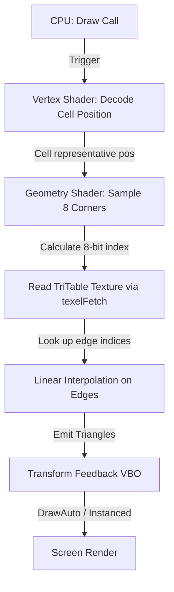

# 🏔️ GPU-Based Marching Cubes: Isosurface Extraction

This document outlines the technical design, performance comparison, and implementation strategy for executing the **Marching Cubes** algorithm entirely on the GPU using a Geometry Shader and Transform Feedback in ModernGL.

---

## 1. Algorithm Overview

The Marching Cubes algorithm extracts a smooth, polygonal 3D surface (an isosurface) from a 3D scalar field (density values).
1. The 3D space is divided into a grid of cubic cells.
2. For each cell, we sample the density values at its **8 corners**.
3. We compare these 8 corner densities against a user-defined **isolevel** (threshold).
4. Each corner is classified as:
   - `0` (outside/empty): density < threshold
   - `1` (inside/solid): density $\ge$ threshold
5. This gives us an 8-bit integer **`cubeindex`** ($0 \sim 255$) representing one of the 256 possible corner configurations.
6. We look up `cubeindex` in a precomputed **Triangulation Table (`triTable`)** to find which edges are intersected and how to connect them into triangles (up to 5 triangles / 15 vertices per cell).
7. We linearly interpolate the intersection points along the intersected edges to find the exact vertex coordinates, forming a smooth surface.

---

## 2. CPU vs. GPU Performance Comparison

For dynamic, real-time volume rendering (such as noise flowing over time or interactive parameters changing), executing the algorithm on the GPU is vastly superior to the CPU.

| Metric | CPU-Based (e.g. scikit-image) | GPU-Based (Geometry Shader + TF) |
| :--- | :--- | :--- |
| **Noise Evaluation** | Evaluated on CPU or read back from GPU (slow). | Evaluated directly in Vertex Shader (extremely fast). |
| **Triangulation Logic** | Processed in Python/C++ CPU loop. | Parallelized per cell in Geometry Shader. |
| **CPU-to-GPU Bandwidth** | **Severe Bottleneck**: Must upload millions of vertices and indices to VRAM every frame ($\approx 50 \text{ MB/frame}$ at resolution 128). | **Zero CPU-GPU Transfer**: Draw call is triggered with 0 bytes, all geometry is built and rendered directly in VRAM. |
| **Framerate (at $128^3$)** | $\approx 3 \sim 8 \text{ FPS}$ (stuttering). | **Stable 60 FPS** (fluid, smooth). |
| **VRAM Footprint** | Dynamic buffers recreated/re-uploaded constantly. | Fixed Transform Feedback buffer allocated once on GPU. |

---

## 3. GPU-Side Implementation Architecture

We leverage the existing **ModernGL Transform Feedback (TF) pipeline** by adapting it from Voxel neighbour culling to Marching Cubes:



### 1. Vertex Shader (`marching_cubes_tf.vert`)
Runs for $(N-1) \times (N-1) \times (N-1)$ vertices representing the **cells** of the grid.
It decodes the `gl_VertexID` into a cell position $(xi, yi, zi)$ in range $[0, N-2]^3$ and passes the cell center coordinate to the Geometry Shader.

### 2. Triangulation Table (`triTable`) as 2D Texture
The `triTable` contains $256 \times 16$ integers. To avoid compiling a massive static array inside the shader (which bloats compile times and can hit driver compiler limits), we upload this table as a **2D Integer Texture** of size $16 \times 256$ with format `GL_R32I` (`dtype='i4'`, components=1).
- In Python:
  ```python
  tri_table_data = np.array(TRI_TABLE, dtype='i4').reshape(256, 16)
  self.tri_table_tex = self.ctx.texture((16, 256), 1, data=tri_table_data.tobytes(), dtype='i4')
  ```
- In GLSL Geometry Shader:
  ```glsl
  uniform isampler2D u_tri_table;
  // Fetch edge index for configuration 'cubeindex' and triangle vertex 'i'
  int edge = texelFetch(u_tri_table, ivec2(i, cubeindex), 0).r;
  ```

### 3. Geometry Shader (`marching_cubes_tf.geom`)
- Input: `points` (1 vertex representing a cell).
- Output: `triangle_strip` (up to 15 vertices for 5 triangles).
- Steps:
  1. Sample density `get_density` at the 8 cell corner offsets:
     - $V_0 = (0,0,0)$, $V_1 = (1,0,0)$, $V_2 = (1,1,0)$, $V_3 = (0,1,0)$
     - $V_4 = (0,0,1)$, $V_5 = (1,0,1)$, $V_6 = (1,1,1)$, $V_7 = (0,1,1)$
  2. Compute `cubeindex`:
     ```glsl
     int cubeindex = 0;
     if (d0 >= u_threshold) cubeindex |= 1;
     if (d1 >= u_threshold) cubeindex |= 2;
     if (d2 >= u_threshold) cubeindex |= 4;
     if (d3 >= u_threshold) cubeindex |= 8;
     if (d4 >= u_threshold) cubeindex |= 16;
     if (d5 >= u_threshold) cubeindex |= 32;
     if (d6 >= u_threshold) cubeindex |= 64;
     if (d7 >= u_threshold) cubeindex |= 128;
     ```
  3. Loop through the `triTable` row for `cubeindex` in strides of 3 to construct triangles:
     ```glsl
     for (int i = 0; i < 16; i += 3) {
         int e0 = texelFetch(u_tri_table, ivec2(i, cubeindex), 0).r;
         if (e0 == -1) break;
         int e1 = texelFetch(u_tri_table, ivec2(i+1, cubeindex), 0).r;
         int e2 = texelFetch(u_tri_table, ivec2(i+2, cubeindex), 0).r;
         
         // Interpolate vertices along edges e0, e1, e2 and Emit!
         EmitTriangleVertex(e0);
         EmitTriangleVertex(e1);
         EmitTriangleVertex(e2);
         EndPrimitive();
     }
     ```

---

## 4. Corner & Edge Conventions (Paul Bourke)

```
       v7 _________ v6
        /|        /|
       / |       / |
    v4/________v5/ |
     |   |      |  |
     | v3|______|__|v2
     |  /       |  /
     | /        | /
    v0/_________v1/
```

- **Vertices**:
  - `0`: `(0,0,0)`, `1`: `(1,0,0)`, `2`: `(1,1,0)`, `3`: `(0,1,0)`
  - `4`: `(0,0,1)`, `5`: `(1,0,1)`, `6`: `(1,1,1)`, `7`: `(0,1,1)`
- **Edges**:
  - `0`: $V_0 \leftrightarrow V_1$, `1`: $V_1 \leftrightarrow V_2$, `2`: $V_2 \leftrightarrow V_3$, `3`: $V_3 \leftrightarrow V_0$
  - `4`: $V_4 \leftrightarrow V_5$, `5`: $V_5 \leftrightarrow V_6$, `6`: $V_6 \leftrightarrow V_7$, `7`: $V_7 \leftrightarrow V_4$
  - `8`: $V_0 \leftrightarrow V_4$, `9`: $V_1 \leftrightarrow V_5$, `10`: $V_2 \leftrightarrow V_6$, `11`: $V_3 \leftrightarrow V_7$
